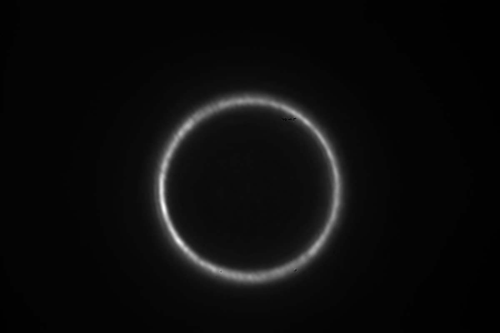
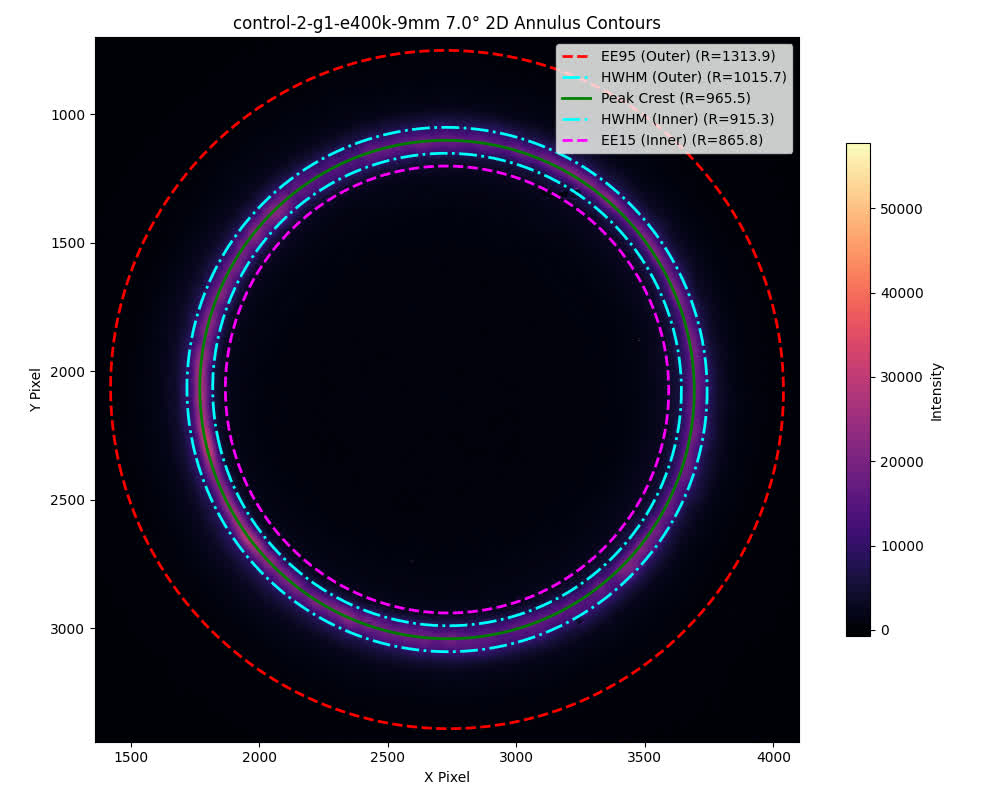
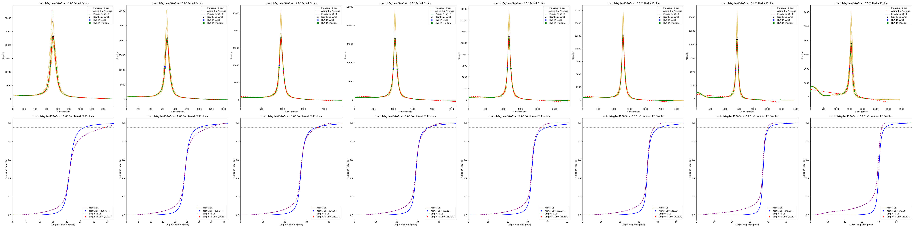
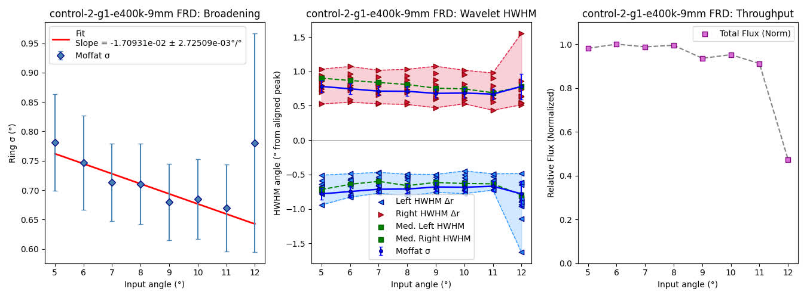

# Circlefinder -- Algorithmic FRD analysis of multimodal fiber optics
### Created by: Simon Dawson -- sdawso@uw.edu

This software was made for fiber optic signal analysis and characterization of focal ratio degradation in a wide array of fibers. 
It is intended to be paired with optical table capable of producing a collimated beam annulus on a bare CCD sensor of choice.

[An example of conducting a collimated beam FRD test (not exactly this setup but conceptually similar)](https://opg.optica.org/viewmedia.cfm?r=1&rwjcode=ao&URI=ao-55-25-6829&seq=0&origin=search)

### Quick Start
Prerequisites: Python >= 3.10, working uv installation on system, MacOS/Linux terminal (for this guide).

After cloning and opening terminal in the repo directory:
   ```
   uv sync
   uv run main.py
   ```
OR, alternatively:
   ```
   uv sync
   source .venv/bin/activate
   python main.py
   ```
These commands should build the environment and run the default analysis of the provided files in `data/` if all prerequisites are met.

***Be sure to build the uv environment before running the pipeline on the included test datafile, unless you want to install everything yourself :B***

Naming conventions are as listed in the example data: 600.tiff == 6 degrees collimated offset. Input is a series of annuli images like the one below, made at increasing collimated offsets, and an approximate distance from the fiber output face to CCD surface. Data is assumed to be taken at same exposure settings with CCD/output face/input face in a fixed relative orientation, and the sensor is unlensed. **The only thing that moves between annular frames is the input beam.**

### An example of a collimated annulus input frame -- 7 degrees offset, output face ~9 mm from CCD:

what you see:


v.s. what the pipeline sees:

postproc.plot_2d_contours:


full control-2 example run (result of Quick Start above):

postproc.plot_stats:


postproc.plot_hwhm_channels: (note the divergence in the last frame!)


### File tree is organized as follows:

circlefinder/
* main.py - execution file, most tweaks happen here
  * Below is the block you mostly want to focus on tweaking, unless making more significant changes:
    ```python
    base_dir = Path(__file__).parent / 'data'    # change to parent directory of image data files,
                                                 # data/ is the default storage dir
    fiber_names = sorted(p.name for p in base_dir.glob('control-2*') # change 'control-2*' to the datafile of focus,
                                                                     # wildcards accepted for multiple runs
                         if p.is_dir() and not p.name.endswith("-bad"))
    if not fiber_names:
        raise SystemExit(f"No fiber directories found under {base_dir}")

    logging.getLogger().setLevel(logging.INFO)   # DEBUG, INFO, WARNING, ERROR, CRITICAL (sensitivity level tags)

    camera_dist_mm = 10.6
    plot_full_fibers = True

    pixel_size_mm = 2.4e-3
    (h, w) = (3660, 5480)
    ```
    You should see the logger output the correct series of angles corresponding to your data if everything runs well. Example log using control-2:
    ```console
    INFO <module>: Processing control-2-g1-e400k-9mm
    INFO <module>:   [*] Found input angles: [ 5.  6.  7.  8.  9. 10. 11. 12.]
    ```
    The software should take it from there. hopefully
    
* input.py - intake and reduction functions
* analysis.py - annular contour generation, elliptical change-of-basis and crest data analysis, radial profile generation. meat and potatoes file
* postproc.py - a bunch of matplotlib functions, some useful some not. functions of importance are plot_hwhm_channels and plot_stats. everything else is largely experimental
* data/control-2-g1-e400k-9mm/ - a demonstrative series of input images and darks with very good quality, except for the last frame


*Claude Sonnet 5.1, Opus 5, and Gemini Pro 3.1 were used in this repository for generating matplotlib functions and general debugging passes via Goose and Antigravity IDEs. All code conceptualized, drafted, edited, and finalized by me (Simon) unless otherwise credited.*
